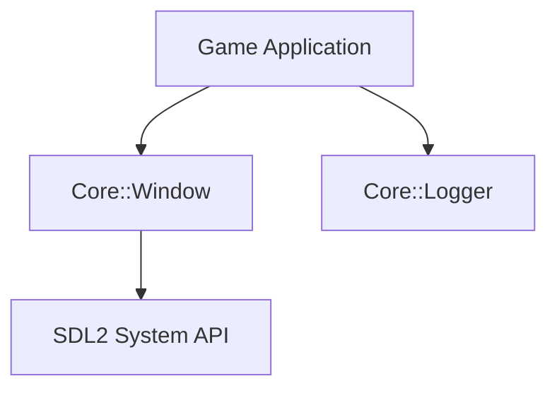

# Week 1: Hello Window & Build System

## Architecture Overview
The engine begins with a decoupled `Window` and `Logger` subsystem.

## Features
- CMake multi-target project build system.
- Cross-platform `Window` abstraction.
- High-resolution frame tick calculation.
